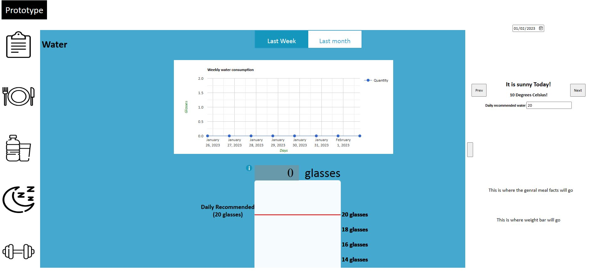
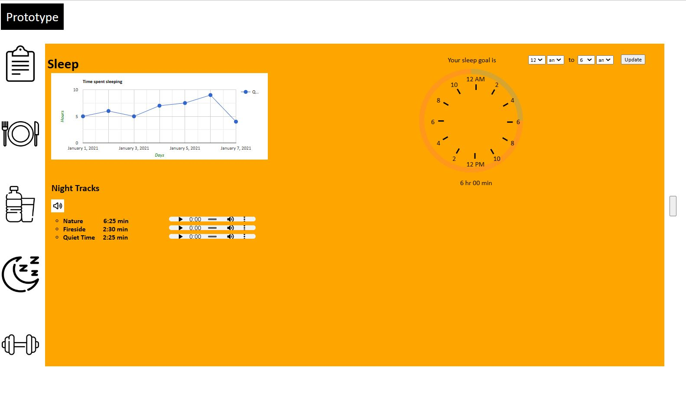
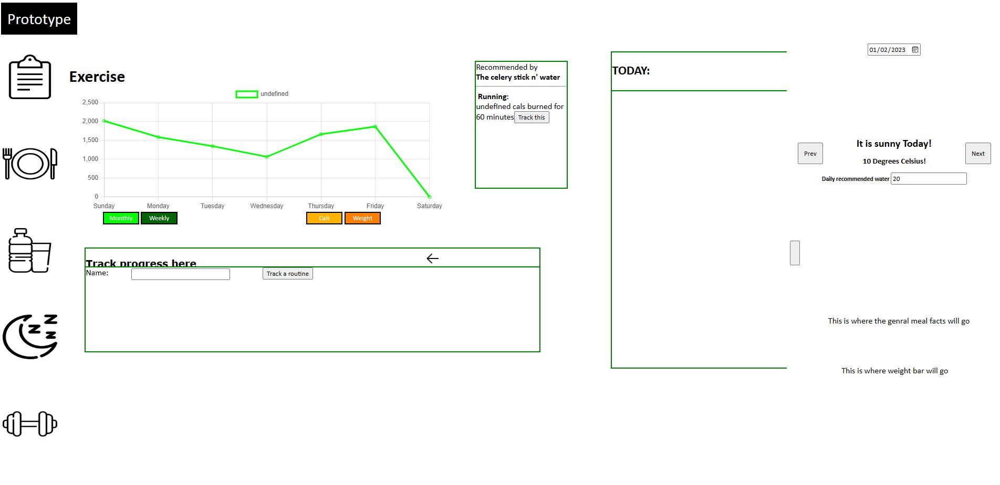

# Fitness Tracker
## Background

This is a prototype website that tracks a user's fitness. It was developed as part of COMP 3020: Human-Computer Interaction. This website wasn't intended to be a finished product. The primary objective was to learn methods and ideas relating to the user-centered design process as well as iterative development. Concepts included human-computer interaction, human perception, memory and cognition as well as prototyping and final product implementation. The website's key features include:

#### Tracking calories
The interface supports a variety of foods that you can track. Depending on what you eat throughout the day, it's as easy as loggin it within the application and boom, you have a snapshot of how many calories you have consumed so far throughout the day.

#### Tracking water consumption
Water is something that often gets overlooked. That's why our application supports tracking of water consumption. You may choose to manually set a target quanitity you need to consume. Our application will notify you at the end of the day as to whether you reached your daily water goal or not. You'll also see a graph of your water consumption of the last couple of days, just for perspective!

#### Tracking sleep
Sleep is an essential aspect of anybody's life. Our application allows you to log hours slept every night. You also get a graph view of what your sleep has been like over the last couple of days. Also, we have some soothing night tracks that you can listen to and fall asleep.

#### Tracking exercise
Our application also allows you to track any exercise you perform. Track the amount of calories you burn, your weight and view trends of what your routine has been like as a graph. 

#### Building a plan
And finally, our website combines all of the above features and allows you to build custom plans - custom meals, custom exercises and so much more!

